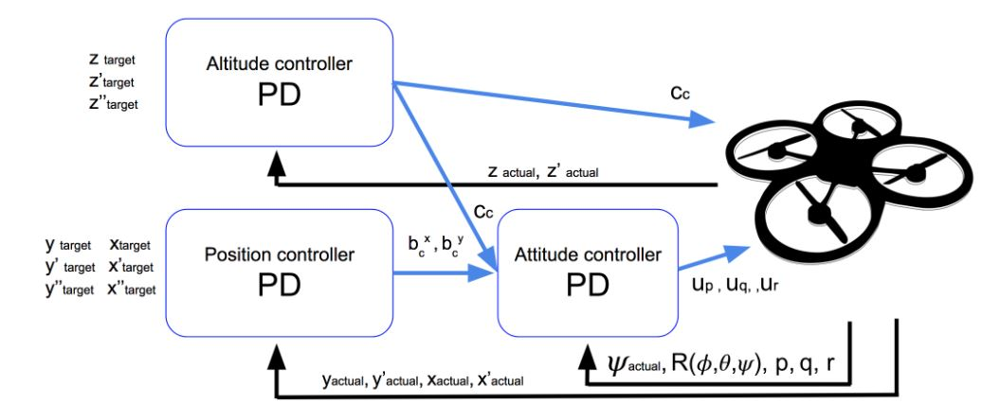
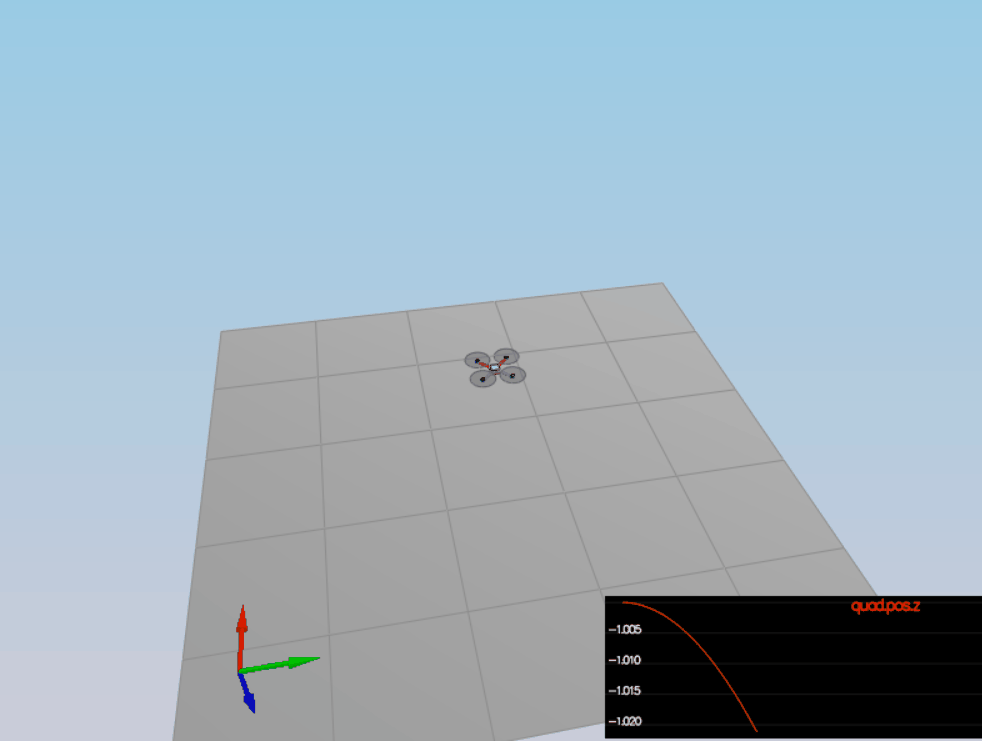
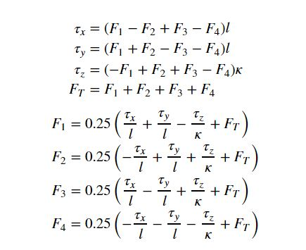
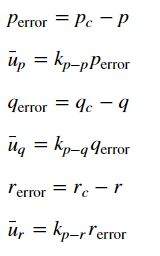
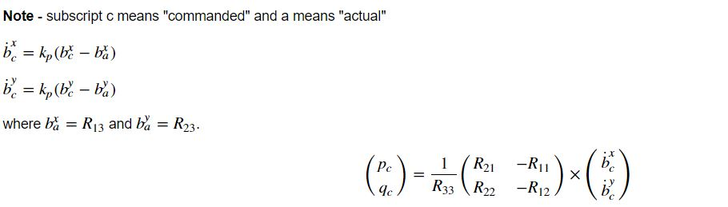
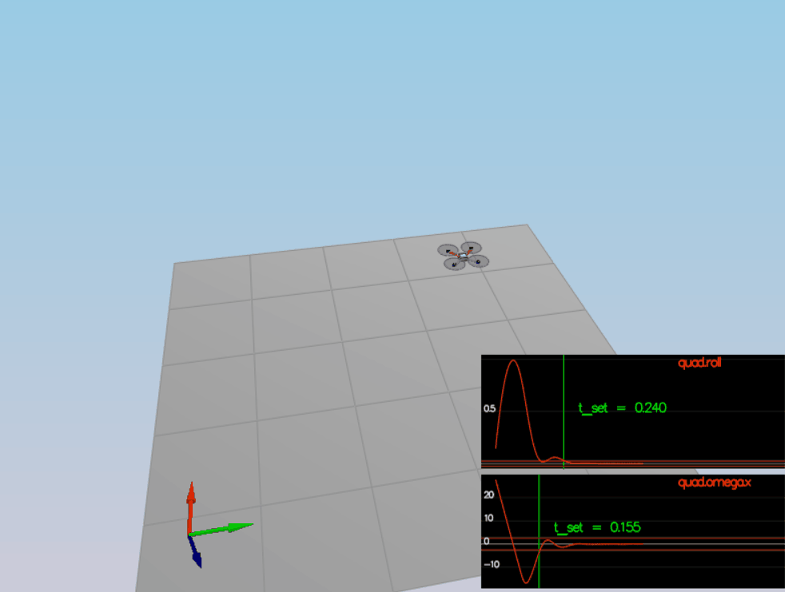
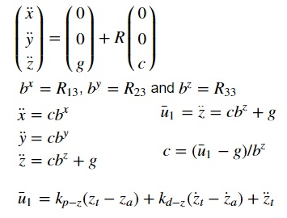
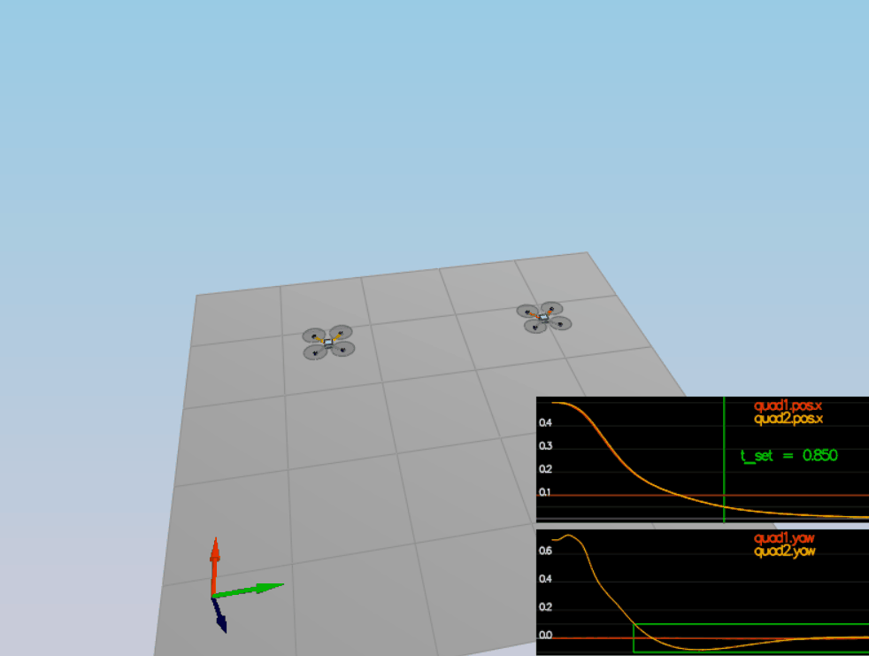
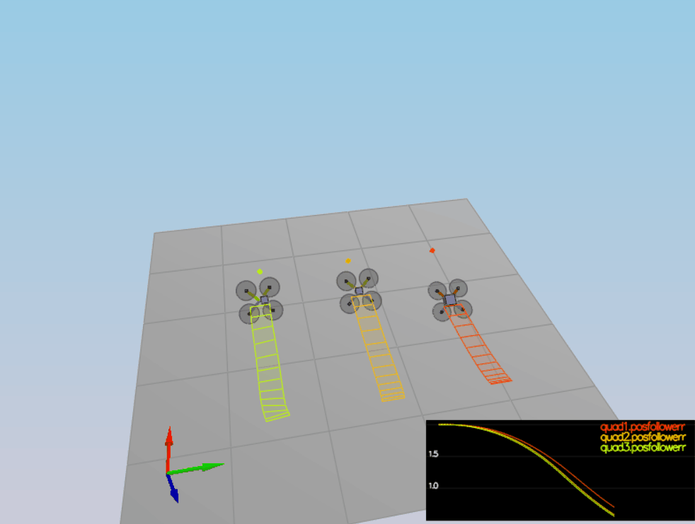
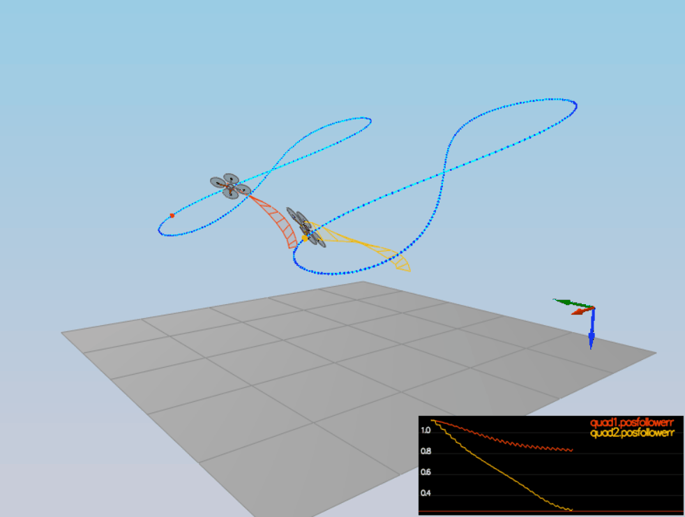

# Quadrotor Controller

In this project, a [cascade PID controller](https://controlstation.com/cascade-control-cascade-control-configured/) is implemented and tuned for drone trajectory tracking. The theory behind the controller design using feed-forward strategy is explained in details on our instructor, [Angela P. Schoellig](http://www.dynsyslab.org/prof-angela-schoellig/), on her paper [Feed-Forward Parameter Identification for Precise Periodic
Quadrocopter Motions](http://www.dynsyslab.org/wp-content/papercite-data/pdf/schoellig-acc12.pdf). The following diagram could be found on that paper describing the cascaded control loops of the trajectory-following controller:



## C++ implementation

There are five scenarios that are needed to be covered. The simulator run in loop on the current scenario and show on the standard output an indication the scenario pass or not.

All the C++ code is in the [/cpp](./cpp) directory. The more interesting files are:

- [/cpp/config/QuadControlParams.txt](./cpp/config/QuadControlParams.txt): This file contains the configuration for the controller. While the simulator is running, it can be modified and the simulator will "refresh" those parameter on the next loop execution.
- [/cpp/src/QuadControl.cpp](./cpp/src/QuadControl.cpp): This  file contains the implementation of the controller only. Most of the time needed to pass the scenarios is spend on the parameter tuning.

### Run the code

Following the instruction on the seed project, load the project on the IDE.

#### Scenario 1: Intro

In this scenario, the mass of the drone is adjusted in [/cpp/config/QuadControlParams.txt](./cpp/config/QuadControlParams.txt) until it hover for a bit:



When the scenario is passing the test, this line is seen on the standard output:

```
PASS: ABS(Quad.PosFollowErr) was less than 0.500000 for at least 0.800000 seconds
```

#### Scenario 2: Body rate and roll/pitch control

The [GenerateMotorCommands method](./cpp/src/QuadControl.cpp#L58-L53) needs to be coded resolving this equations:



Where all the `F_1` to `F_4` are the motors thrust, `tao(x,y,z)` are the moments on each direction, `F_T` is the total thrust, kappa is the drag/thrust ratio and `l` is the drone arm length over square root of two. These equations comes from the classroom lectures. There are a couple of thing to consider. For example, on NED coordinates the `z` axis is inverted that is why the moment on `z` was inverted here. Another observation while implementing this is that `F_3` and `F_4` are switched, e.g. `F_3` in the lectures is `F_4` on the simulator and the same for `F_4`.

The second step is to implement the [BodyRateControl method](./cpp/src/QuadControl.cpp#L95-L121) applying a [P controller](https://en.wikipedia.org/wiki/Proportional_control) and the moments of inertia. At this point the `kpPQR` parameter have to me tuned to stop the drone from flipping, but first some thrust need to be commanded in the altitude control because we don't have thrust commanded on the `GenerateMotorCommands` anymore. A good value is `thurst = mass * CONST_GRAVITY`.

Once this is done, we move on to the [RollPitchControl method](./cpp/src/QuadControl.cpp#L124-L167). For this implementation a few equations are needed to be applied. 



But the problem is you need to output roll and pitch rates; so, there is another equation to apply:



It is important to noticed you received thrust and thrust it need to be inverted and converted to acceleration before applying the equations.



When the scenario is passing the test, this line is seen on the standard output:

```
PASS: ABS(Quad.Roll) was less than 0.025000 for at least 0.750000 seconds
PASS: ABS(Quad.Omega.X) was less than 2.500000 for at least 0.750000 seconds
```

#### Scenario 3: Position/velocity and yaw angle control

There a three methods to implement here:

- [AltitudeControl](./cpp/QuadControl.cpp#L169-L212): This is a [PD controller](https://en.wikipedia.org/wiki/PID_controller) to control the acceleration meaning the thrust needed to control the altitude.



In order to test this, go back to scenario 2 and make sure the drone doesn't fall. In that scenario the PID is configured to not act and the thrust should be `mass * CONST_GRAVITY`.

- [LateralPositionControl](./cpp/QuadControl.cpp#L215-L267) This is another PID controller to control acceleration on `x` and `y`.

- [YawControl](./cpp/QuadControl.cpp#L270-L302): This is a simpler case because it is P controller. It is better to optimize the yaw to be between `[-pi, pi]`.

Once all the code is implemented, put all the `kpYaw`,`kpPosXY`, `kpVelXY`, `kpPosZ` and `kpVelZ` to zero. Take a deep breath, and start tuning from the altitude controller to the yaw controller. It takes time. Here is a video of the scenario when it pass:



When the scenario is passing the test, this line is seen on the standard output:

```
PASS: ABS(Quad1.Pos.X) was less than 0.100000 for at least 1.250000 seconds
PASS: ABS(Quad2.Pos.X) was less than 0.100000 for at least 1.250000 seconds
PASS: ABS(Quad2.Yaw) was less than 0.100000 for at least 1.000000 seconds
```

#### Scenario 4: Non-idealities and robustness

Everything is coded and tuned already, right? Ok, we need to add the an integral part to the altitude controller to move it from PD to PID controller. What happen to me here is that everything start not working correctly and I have to tune everything again, starting from scenario -1. Remember patience is a "virtue", and to it again. If you cannot and get frustrated talk to your peers, they will be able to give you hints. It is hard, but doable:



When the scenario is passing the test, you should see this line on the standard output:

```
PASS: ABS(Quad1.PosFollowErr) was less than 0.100000 for at least 1.500000 seconds
PASS: ABS(Quad2.PosFollowErr) was less than 0.100000 for at least 1.500000 seconds
PASS: ABS(Quad3.PosFollowErr) was less than 0.100000 for at least 1.500000 seconds
```

#### Scenario 5: Tracking trajectories

This is the final non-optional scenario. The drone needs to follow a trajectory. There are comments on the controller methods regarding limits that needs to me imposed on the code. Here those limits are needed to pass.



When the scenario is passing the test, this line is seen on the standard output:

```
PASS: ABS(Quad2.PosFollowErr) was less than 0.250000 for at least 3.000000 seconds
```
